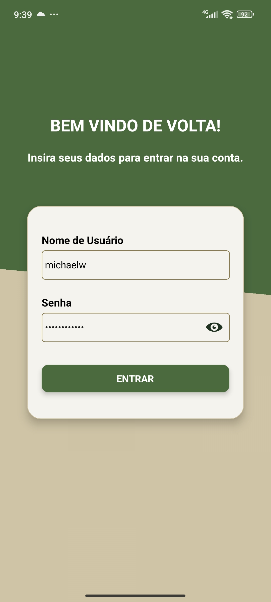
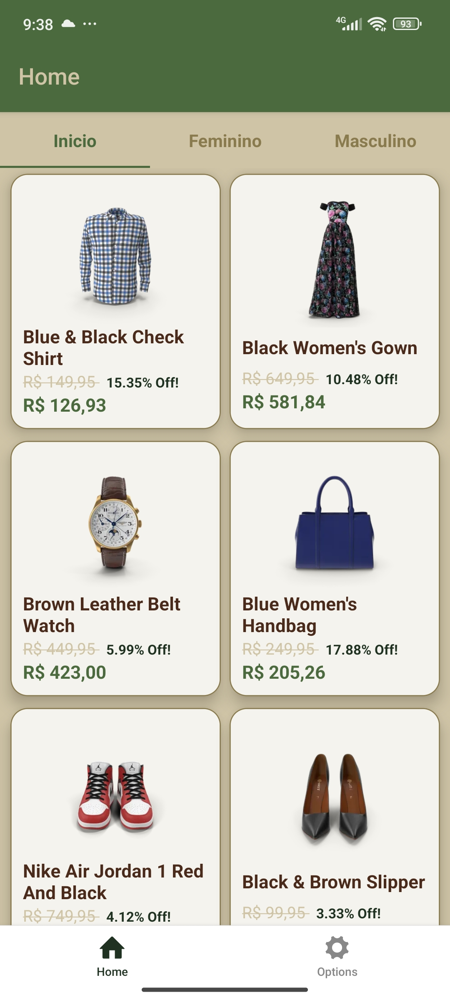
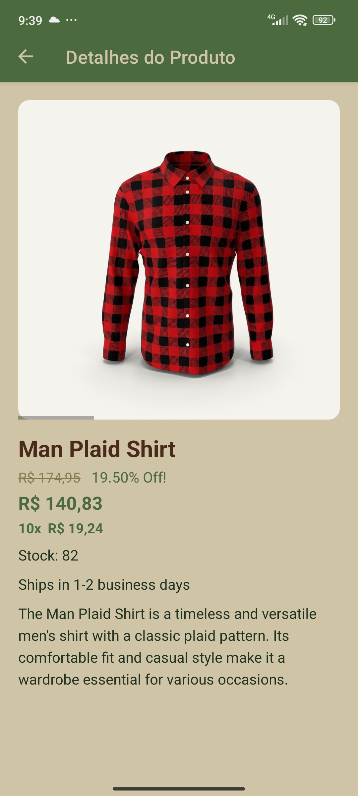
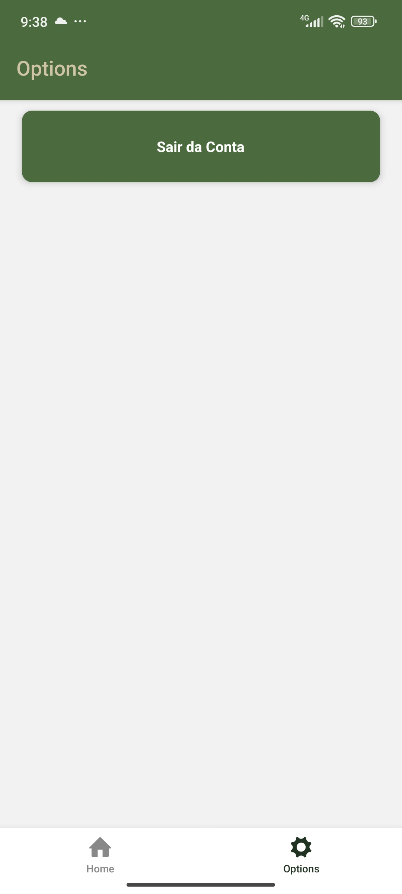

# 🛒 Modelo de Loja Virtual (E-commerce App)

Este projeto é um aplicativo mobile desenvolvido como trabalho acadêmico para a disciplina de **Mobile Development**. Trata-se de um modelo funcional de loja virtual (e-commerce), com foco na criação de interfaces modernas, componentização de UI, roteamento de telas e consumo de APIs REST.

## 🛠️ Tecnologias e Inicialização

O projeto foi inicializado utilizando o **Expo**, garantindo uma configuração rápida e padronizada. Foi utilizado o template em branco focado em TypeScript para garantir a tipagem estática e maior segurança no código:

`npx create-expo-app meu-app --template blank-typescript`

## 📦 Dependências Utilizadas

Para atender aos requisitos do aplicativo, foram adicionadas as seguintes bibliotecas fundamentais:

* **[Axios](https://axios-http.com/docs/intro)**: Cliente HTTP baseado em *Promises* utilizado para fazer requisições à API REST (como o envio de credenciais no login).
* **[React Navigation](https://reactnavigation.org/)**: Principal solução de roteamento do ecossistema React Native. Foram utilizadas três bibliotecas deste pacote para compor a navegação da loja:
  * `@react-navigation/native-stack`: Para a navegação em pilha (ex: ir da tela de Login para o fluxo principal do App).
  * `@react-navigation/bottom-tabs`: Para o menu de navegação inferior (ex: Início, Carrinho, Perfil).
  * `@react-navigation/material-top-tabs`: Para navegação em abas no topo da tela (ex: separação de categorias de produtos).
* **[React Native Vector Icons](https://github.com/oblador/react-native-vector-icons) / Entypo**: Utilizado para renderizar ícones vetoriais na interface, melhorando a experiência do usuário (ex: ícone de visualizar/ocultar senha).

## 🚀 Como testar o projeto (Expo Go)

A maneira mais fácil e recomendada de rodar este aplicativo durante o desenvolvimento ou para avaliação é utilizando o aplicativo **[Expo Go](https://expo.dev/client)**, disponível gratuitamente para Android e iOS.

1. Baixe o **Expo Go** na sua loja de aplicativos (Google Play ou App Store).
2. Clone este repositório e instale as dependências:
   `npm install`
3. Inicie o servidor do Expo:
   `npx expo start`
4. Abra o **Expo Go** no seu celular e escaneie o **QR Code** que aparecerá no terminal.

## 📱 Telas e Funcionalidades

Abaixo estão as principais telas que compõem o aplicativo e suas responsabilidades:

### 1. Tela de Login
Responsável pela autenticação do usuário. Possui componentes customizados (inputs e botões), validação de campos vazios, feedback visual de carregamento ("Entrando...") e controle para exibir/ocultar a senha de forma nativa.

### 2. Tela Inicial (Loja / Produtos)
Exibe o catálogo de produtos utilizando navegação por abas. O layout foi construído pensando na experiência de e-commerce, permitindo que o usuário visualize os itens de forma clara.

### 3. Tela de Detalhes *(Ajuste o título conforme o seu app)*
Permite ao usuário ver detalhes sobre os produtos, como preço, descrição. Inclui um carrossel de imagens do produto.

### 4. Tela de Opções *(Ajuste o título conforme o seu app)*
Neste modelo permite somente realizar o 'logoff', apagando os dados de navegãçã oe retornando à tela de 'login'.

---

**Nota:** *Projeto desenvolvido para fins educacionais - Disciplina de Mobile Development.*